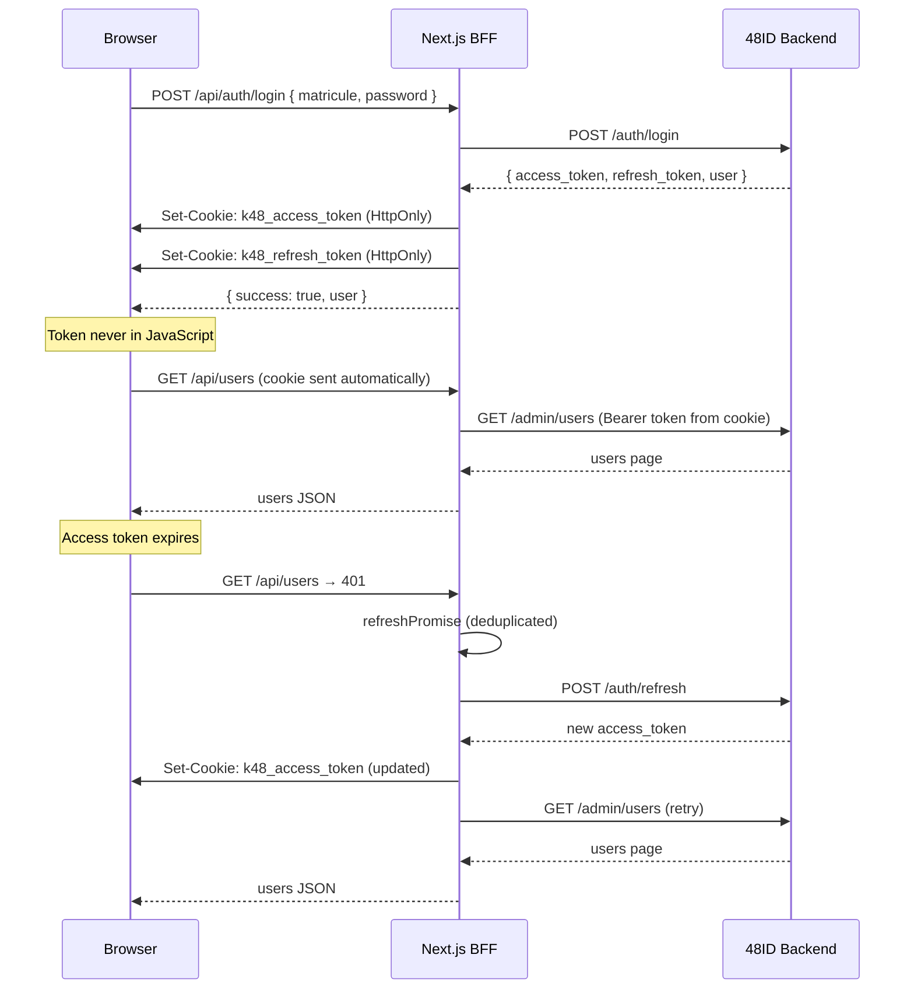

<div align="center">

# 🖥️ 48ID Web

**The Admin Portal for the K48 Identity Platform**

[](https://github.com/mrvin100/48id-web/actions)
[](LICENSE)
[](https://nextjs.org/)
[](https://www.typescriptlang.org/)

The administration portal for 48ID — manage users, provision accounts, monitor audit logs, and control API keys.

[Documentation](docs) • [Quick Start](#-quick-start) • [Architecture](docs/guide/architecture.md) • [Contributing](CONTRIBUTING.md)

</div>

---

## 🌟 Overview

**48ID Web** is the admin-facing frontend of the K48 identity platform. It connects to the [48ID backend](https://github.com/mrvin100/48id) through a Next.js BFF (Backend For Frontend) layer that handles authentication, token management, and API proxying.

### What the portal provides

| Feature | Description |
|---------|-------------|
| 🔑 **Authentication** | Secure login with HttpOnly cookie session management |
| 👥 **User Management** | Browse, search, edit, suspend, and manage K48 users |
| 📦 **CSV Provisioning** | Bulk import users from CSV with preview and validation |
| 📋 **Audit Log** | Paginated, filterable security event history |
| 🔐 **API Keys** | Create, rotate, and revoke API keys for K48 services |
| ⚙️ **Settings** | Admin profile management and password change |

---

## 🏗️ Architecture

48ID Web uses a **BFF (Backend For Frontend)** pattern. The Next.js app acts as a secure proxy — tokens never reach the browser.

```mermaid
graph TB
    subgraph "Browser"
        UI[React Components]
        Store[Zustand Store]
        Query[TanStack Query]
    end

    subgraph "Next.js BFF (app/api)"
        Login[/api/auth/login]
        Refresh[/api/auth/refresh]
        Users[/api/users]
        Admin[/api/admin/*]
    end

    subgraph "48ID Backend"
        AuthAPI[auth endpoints]
        AdminAPI[admin endpoints]
        AuditAPI[audit endpoints]
    end

    UI --> Query
    Query --> Store
    Query -->|HTTP + cookies| Login
    Query -->|HTTP + cookies| Users
    Query -->|HTTP + cookies| Admin

    Login -->|JWT| AuthAPI
    Refresh -->|refresh token| AuthAPI
    Users -->|Bearer token| AdminAPI
    Admin -->|Bearer token| AdminAPI
    Admin -->|Bearer token| AuditAPI
```

### Data flow

```
Component → Custom Hook → TanStack Query → lib/api function → BFF Route Handler → 48ID Backend
```

Every feature follows this exact layered pattern — no component makes direct API calls.

### Folder structure

```
src/
├── app/
│   ├── (auth)/               # Public auth pages (login, activate, reset-password)
│   ├── (dashboard)/          # Protected admin pages
│   └── api/                  # BFF Route Handlers (proxy to 48ID)
├── components/
│   ├── modules/              # Feature modules (auth, users, dashboard, ...)
│   ├── ui/                   # shadcn/ui primitives — do not edit directly
│   ├── global/               # Shared layout components
│   └── forms/                # Reusable form components
├── hooks/                    # TanStack Query hooks (one file per feature)
├── lib/
│   ├── api/                  # HTTP functions (one file per domain)
│   ├── routes.ts             # Centralized route constants
│   ├── query-keys.ts         # TanStack Query key factories
│   └── env.ts                # Environment configuration
├── services/                 # Auth service (login/logout/refresh)
├── stores/                   # Zustand stores (auth, ui, csv)
└── types/                    # TypeScript interfaces
```

---

## ⚡ Quick Start

### Prerequisites

- **Node.js 20+**
- **pnpm 9+**
- **48ID backend running** on `http://localhost:8080`

### 1. Clone and install

```bash
git clone https://github.com/mrvin100/48id-web.git
cd 48id-web
pnpm install
```

### 2. Configure environment

```bash
cp .env.example .env
```

The `.env.example` documents every variable. For local development the defaults work out of the box assuming 48ID runs on port 8080.

### 3. Start the dev server

```bash
pnpm dev
```

The portal starts at **http://localhost:3000**

### 4. Verify it's working

- Navigate to `http://localhost:3000` — you should be redirected to `/login`
- Log in with an admin account from the 48ID backend
- The dashboard should load with metrics and navigation

---

## 🔐 Authentication Architecture

The portal uses **Option A — Custom BFF** as defined in the architecture decision records. Better Auth was evaluated and deliberately not adopted (see [ADR-006](docs/guide/architecture.md#adr-006-authentication-strategy)).

### Token flow



### Session persistence

- User profile stored in `localStorage` via Zustand persist (display data only — no tokens)
- Tokens live exclusively in HttpOnly cookies
- On page refresh: middleware validates the cookie, silent refresh if expired
- On tab close: session remains valid until token expiry (15 min access, 7 days refresh)

---

## 📚 Documentation

| Section | Description |
|---------|-------------|
| **[Architecture](docs/guide/architecture.md)** | Data flow, BFF pattern, ADRs, module structure |
| **[Environment Setup](docs/guide/environment-setup.md)** | Variables, profiles, Docker, troubleshooting |
| **[Contributing](CONTRIBUTING.md)** | Workflow, standards, branch naming, PR process |
| **[Story Workflow](docs/developers/story-workflow.md)** | How to implement backlog stories step by step |
| **[API Reference](docs/api/bff-routes.md)** | All BFF route handlers documented |

---

## 🛠️ Tech Stack

| Layer | Technology |
|-------|-----------|
| **Framework** | Next.js 16.1 (App Router, Turbopack) |
| **Language** | TypeScript 5 (strict mode) |
| **Styling** | Tailwind CSS v4 |
| **Components** | shadcn/ui (new-york style) |
| **HTTP Client** | ky 1.14 |
| **Server State** | TanStack Query v5 |
| **Client State** | Zustand 5 |
| **Forms** | React Hook Form + Zod |
| **Unit Tests** | Vitest + React Testing Library |
| **E2E Tests** | Cypress |
| **Package Manager** | pnpm |

---

## 🤝 Contributing

We welcome contributions! Read the [Contributing Guide](CONTRIBUTING.md) before opening a PR.

```bash
# Install dependencies
pnpm install

# Start dev server
pnpm dev

# Type check
pnpm type-check

# Lint
pnpm lint

# Run unit tests
pnpm test

# Run E2E tests
pnpm cy:open
```

👉 **[Complete Contributing Guide](CONTRIBUTING.md)**

---

## 📋 Project Status

This repository implements the **MVP scope** of 48ID Web:

✅ Secure login with HttpOnly cookie session  
✅ Silent token refresh with deduplication  
✅ Dashboard with metrics and activity feed  
✅ User list with search, filter, pagination  
✅ User detail sheet with edit, suspend, role change  
✅ CSV bulk provisioning with preview and validation  
✅ Account activation and password reset flows  
✅ Audit log with filters and user resolution  
✅ API key management (create, rotate, revoke)  
✅ Admin profile settings  

**Future roadmap:**
- Cmd+K command palette
- Dark/light theme toggle
- Lighthouse CI enforcement
- Full Cypress E2E suite

---

## 📄 License

This project is licensed under the [MIT License](LICENSE).

---

## 🙏 Acknowledgments

Built with ❤️ by the K48 Team.

**Part of the K48 ecosystem:**
- **48ID Web** — Admin portal (this repository)
- [48ID](https://github.com/mrvin100/48id) — Identity provider backend
- [48Hub](https://github.com/mrvin100/48hub) — Alumni platform
- [LP48](https://github.com/mrvin100/lp48) — Project showcase

---

<div align="center">

**[⬆ Back to top](#️-48id-web)**

</div>
