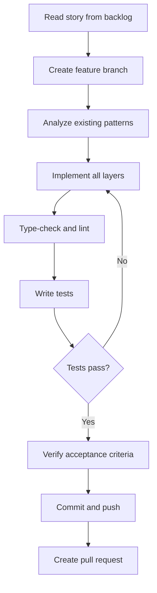

# Story Implementation Workflow

This guide describes the complete workflow for implementing user stories from the MVP backlog.

## Prerequisites

- Node.js 20+, pnpm 9+
- 48ID backend running on port 8080
- `.env` configured (see [Environment Setup](../guide/environment-setup.md))

## Workflow Overview



---

## Step 1: Read the Story

**Location:** `MVP/48IDweb_Backlog_MVP (1).md`

Extract:
- **Story ID** (e.g., `WEB-04-03`)
- **Acceptance criteria** (GIVEN / WHEN / THEN)
- **Artefacts** (files to create or modify)
- **Strategy** (SSR / CSR / Server Route Handler)

---

## Step 2: Create Feature Branch

```bash
git checkout main && git pull origin main
git checkout -b feature/WEB-<STORY-ID>-<short-description>

# Example
git checkout -b feature/WEB-04-03-user-edit-form
```

---

## Step 3: Implement All Layers

Every feature must implement **all layers in order**:

### Layer 1 — BFF Route Handler (`app/api/`)

```typescript
// Standard pattern — copy this for every new BFF route
export async function GET(request: NextRequest) {
  const cookieStore = await cookies()
  const jwtToken = cookieStore.get(config.auth.jwtCookieName)?.value
  if (!jwtToken) return NextResponse.json({ error: 'Authentication required' }, { status: 401 })

  const response = await fetch(`${config.backend.apiUrl}/admin/resource`, {
    headers: { Authorization: `Bearer ${jwtToken}` },
  })
  if (!response.ok) return NextResponse.json({ error: `Backend error: ${response.status}` }, { status: response.status })
  return NextResponse.json(await response.json())
}
```

### Layer 2 — API Function (`lib/api/`)

```typescript
export const resourceApi = {
  getResource: () => apiClient.get('resource').json<Resource>(),
  updateResource: (id: string, data: UpdateData) =>
    apiClient.put(`resource/${id}`, { json: data }).json<Resource>(),
}
```

### Layer 3 — Query Key (`lib/query-keys.ts`)

```typescript
export const resourceKeys = {
  all: ['resource'] as const,
  detail: (id: string) => [...resourceKeys.all, id] as const,
}
```

### Layer 4 — Hook (`hooks/use-resource.ts`)

```typescript
export function useResource(id: string) {
  return useQuery({
    queryKey: resourceKeys.detail(id),
    queryFn: () => resourceApi.getResource(id),
    staleTime: 5 * 60 * 1000,
  })
}
```

### Layer 5 — Module Component (`components/modules/<feature>/`)

```typescript
'use client'
export function ResourceModule() {
  const { data, isLoading, error } = useResource(id)
  if (isLoading) return <Skeleton />
  if (error) return <ErrorMessage />
  return <ResourceView data={data} />
}
```

### Layer 6 — Page (`app/(dashboard)/<feature>/page.tsx`)

```typescript
// Pages are thin wrappers only
import { ResourceModule } from '@/components/modules/resource'
export default function ResourcePage() {
  return <ResourceModule />
}
```

### Layer 7 — Export from index files

```typescript
// hooks/index.ts
export * from './use-resource'

// lib/api/index.ts
export * from './resource'
export { resourceApi } from './resource'

// components/modules/resource/index.ts
export { ResourceModule } from './resource-module'
```

---

## Step 4: Add Route Constants

All new routes go in `lib/routes.ts`:

```typescript
export const ROUTES = {
  // ...existing routes
  NEW_FEATURE: '/new-feature',
  API: {
    // ...existing
    NEW_FEATURE: '/api/new-feature',
  }
}
```

---

## Step 5: Type Check and Lint

```bash
pnpm type-check
pnpm lint
```

Fix all errors before proceeding.

---

## Step 6: Write Tests

```typescript
// hooks/use-resource.test.ts
describe('useResource', () => {
  it('returns resource data', async () => {
    server.use(http.get('/api/resource/1', () => HttpResponse.json(mockResource)))
    const { result } = renderHook(() => useResource('1'), { wrapper: QueryWrapper })
    await waitFor(() => expect(result.current.isSuccess).toBe(true))
    expect(result.current.data).toEqual(mockResource)
  })
})
```

```bash
pnpm test
```

---

## Step 7: Verify Acceptance Criteria

Create a checklist before opening the PR:

| Criterion | Status |
|-----------|--------|
| GIVEN admin navigates to page WHEN loaded THEN data appears | ✅ |
| GIVEN invalid input WHEN submitted THEN validation error shown | ✅ |

---

## Step 8: Commit and Push

```bash
git add <files>
git commit --no-verify -m "feat: add resource management (WEB-04-03)"
git push -u origin feature/WEB-04-03-resource-management
```

> Note: Use `--no-verify` when committing from WSL (Husky requires Node in PATH).

---

## Step 9: Create Pull Request

**Title:** `feat: description (WEB-XX-XX)`

**Description template:**

```markdown
## Overview
Implements **WEB-XX-XX**: [Story Title]

## Changes
- `path/to/file` — description

## Acceptance Criteria
| Criterion | Status |
|-----------|--------|
| AC 1 | ✅ |
| AC 2 | ✅ |

## Related
- Epic: EXX — [Epic Name]
```

---

## Quick Reference

### Common commands

```bash
pnpm dev          # Start dev server
pnpm type-check   # TypeScript check
pnpm lint         # ESLint
pnpm test         # Unit tests
pnpm cy:open      # E2E tests
```

### Key files

| Purpose | File |
|---------|------|
| Route constants | `src/lib/routes.ts` |
| Query keys | `src/lib/query-keys.ts` |
| HTTP client | `src/lib/api/client.ts` |
| Auth store | `src/stores/auth-store.ts` |
| Middleware | `middleware.ts` |
| Backlog | `MVP/48IDweb_Backlog_MVP (1).md` |
