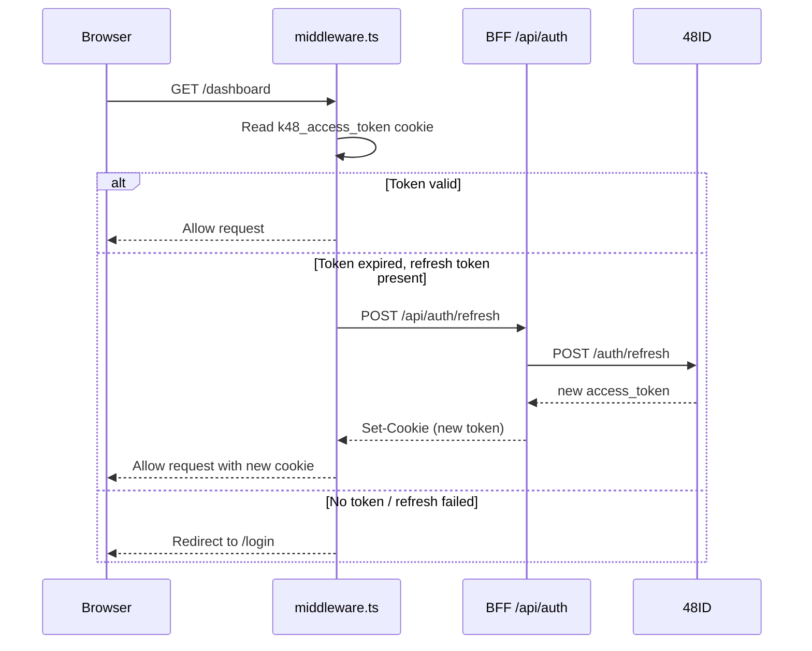

# Architecture

## System Overview

48ID Web is the admin portal for the K48 identity platform. It is a **Next.js 16 application** that acts as a BFF (Backend For Frontend) — it proxies all API calls to the 48ID backend, manages tokens in HttpOnly cookies, and serves a React UI to authenticated administrators.

```mermaid
graph TB
    subgraph "Browser"
        UI[React UI]
        Zustand[Zustand Store]
        TQ[TanStack Query Cache]
    end

    subgraph "Next.js App (48id-web)"
        Pages[Pages / Layouts]
        Modules[Feature Modules]
        Hooks[Custom Hooks]
        ApiLib[lib/api functions]
        BFF[BFF Route Handlers<br/>app/api/]
        MW[middleware.ts<br/>Route Guard]
    end

    subgraph "48ID Backend"
        AuthAPI[/auth/*]
        AdminAPI[/admin/*]
        AuditAPI[/admin/audit-log]
    end

    UI --> Modules
    Modules --> Hooks
    Hooks --> TQ
    TQ --> ApiLib
    ApiLib -->|HTTP + cookies| BFF
    BFF -->|Bearer token| AuthAPI
    BFF -->|Bearer token| AdminAPI
    BFF -->|Bearer token| AuditAPI
    MW -->|validates cookie| BFF
```

## Data Flow

Every feature follows this exact layered pattern:

```
Page (thin wrapper)
  └── Module Component (UI logic)
        └── Custom Hook (TanStack Query)
              └── lib/api function (HTTP)
                    └── BFF Route Handler (proxy)
                          └── 48ID Backend
```

No component ever calls `fetch` or `apiClient` directly. No page contains business logic.

### Layer responsibilities

| Layer | Location | Responsibility |
|-------|----------|----------------|
| **Page** | `app/(dashboard)/*/page.tsx` | Renders the module. Nothing else. |
| **Module** | `components/modules/*/` | UI rendering, form state, user interactions |
| **Hook** | `hooks/use-*.ts` | TanStack Query `useQuery` / `useMutation` |
| **API** | `lib/api/*.ts` | Pure HTTP functions using `apiClient` |
| **BFF** | `app/api/*/route.ts` | Auth proxy — reads cookie, forwards Bearer token |
| **Middleware** | `middleware.ts` | Route protection, silent token refresh |

---

## Authentication Architecture

### ADR-006: Authentication Strategy

**Decision:** Custom BFF with HttpOnly cookies. Better Auth was evaluated and rejected.

**Rationale:**
- 48ID is already a full identity provider — it issues JWTs, manages sessions, handles refresh
- Better Auth would require its own database tables (`session`, `account`, `user`) duplicating what already exists in PostgreSQL managed by 48ID
- Two sources of truth for the same user identity is a maintenance problem
- The custom BFF is ~60 lines of code — not complex enough to justify a framework

### Token lifecycle



### Silent refresh deduplication

The `lib/api/client.ts` ky instance handles 401 responses from BFF routes:

```typescript
let refreshPromise: Promise<boolean> | null = null

// afterResponse hook — fires on every 401
async (request, _options, response) => {
  if (response.status === 401) {
    // All concurrent 401s share one refresh call
    const refreshed = await attemptRefresh()
    if (refreshed) return ky(request) // retry original
    window.location.href = '/login?reason=session_expired'
  }
}
```

### Session persistence

- **Tokens:** HttpOnly cookies only — never in JavaScript
- **User profile:** `localStorage` via Zustand persist (display data only)
- **Session timeout:** 30 minutes of inactivity clears the Zustand store

---

## Module Structure

```
src/
├── app/
│   ├── (auth)/                   # Unauthenticated routes
│   │   ├── login/
│   │   ├── activate-account/
│   │   └── reset-password/
│   ├── (dashboard)/              # Authenticated routes (protected by middleware)
│   │   ├── dashboard/
│   │   ├── users/
│   │   ├── provisioning/
│   │   ├── audit/
│   │   ├── api-keys/
│   │   └── settings/
│   └── api/                      # BFF Route Handlers
│       ├── auth/                 # login, logout, refresh, activate, reset-password
│       ├── users/[id]/           # GET, PUT, status, reset-password
│       ├── admin/
│       │   ├── users/import/     # CSV import proxy
│       │   ├── audit-log/        # Audit log with user resolution
│       │   └── api-keys/         # API key management
│       ├── dashboard/            # metrics, login-activity, recent-activity
│       └── csv/                  # template download
├── components/
│   ├── modules/                  # Feature modules (one folder per feature)
│   ├── ui/                       # shadcn/ui — do not edit
│   └── global/                   # Shared layout components
├── hooks/                        # TanStack Query hooks
├── lib/
│   ├── api/                      # HTTP functions
│   ├── routes.ts                 # Route constants (single source of truth)
│   ├── query-keys.ts             # Query key factories
│   └── env.ts                    # Environment config
├── services/                     # Auth service
├── stores/                       # Zustand stores
└── types/                        # TypeScript interfaces
```

---

## State Management

### TanStack Query (server state)

All data fetched from the backend is managed by TanStack Query:

```typescript
// Query key factories ensure consistent cache management
export const usersKeys = {
  all: ['users'] as const,
  list: (filters?: UserFilters) => [...usersKeys.all, 'list', filters] as const,
  detail: (id: string) => [...usersKeys.all, 'detail', id] as const,
}

// Hooks wrap api functions
export function useUsers(filters?: UserFilters) {
  return useQuery({
    queryKey: usersKeys.list(filters),
    queryFn: () => usersApi.getUsers(filters),
    staleTime: 5 * 60 * 1000,
  })
}
```

### Zustand (client state)

| Store | Purpose | Persistence |
|-------|---------|-------------|
| `auth-store` | User profile, auth status | `localStorage` |
| `ui-store` | Sidebar state, theme | `localStorage` |
| `csv-store` | CSV import wizard state | None (session only) |

---

## Middleware (Route Protection)

`middleware.ts` runs before every request and handles:

1. **Static files / Next.js internals** — pass through
2. **Public routes** (`/login`, `/activate-account`, `/reset-password`) — pass through
3. **Public API routes** (`/api/auth/login`, `/api/auth/refresh`, etc.) — pass through
4. **Protected API routes** — validate JWT cookie, return 401 if invalid
5. **Protected pages** — validate JWT, attempt silent refresh, redirect to `/login` if failed

All route strings are defined as constants in `lib/routes.ts` — the middleware imports them directly.

---

## Error Handling

### Backend error format

The 48ID backend returns [RFC 9457 Problem Details](https://www.rfc-editor.org/rfc/rfc9457):

```json
{
  "type": "https://48id.k48.io/errors/reset-token-invalid",
  "title": "Reset Token Invalid",
  "status": 400,
  "detail": "Invalid reset token.",
  "timestamp": "2026-03-19T10:00:00Z",
  "code": "RESET_TOKEN_INVALID"
}
```

BFF routes read `data.detail` (not `data.message`) when forwarding errors to the frontend.

### Client error handling

- `lib/api/*.ts` functions catch `HTTPError` from ky and throw plain `Error` with the backend `detail` message
- TanStack Query surfaces errors via `isError` / `error` in hooks
- Components display `(error as Error).message` — never raw ky error strings

---

## ADR Index

| ADR | Decision | Status |
|-----|----------|--------|
| ADR-001 | Next.js App Router over Pages Router | ✅ Adopted |
| ADR-002 | TanStack Query for server state | ✅ Adopted |
| ADR-003 | Zustand for client state | ✅ Adopted |
| ADR-004 | ky over axios for HTTP | ✅ Adopted |
| ADR-005 | shadcn/ui over custom component library | ✅ Adopted |
| ADR-006 | Custom BFF over Better Auth | ✅ Adopted |
| ADR-007 | pnpm over npm/yarn | ✅ Adopted |

---

## Next Steps

- **[Environment Setup](environment-setup.md)** — Configure and run locally
- **[Contributing](../../CONTRIBUTING.md)** — How to contribute
- **[Story Workflow](../developers/story-workflow.md)** — Implement backlog stories
- **[BFF API Reference](../api/bff-routes.md)** — All route handlers documented
